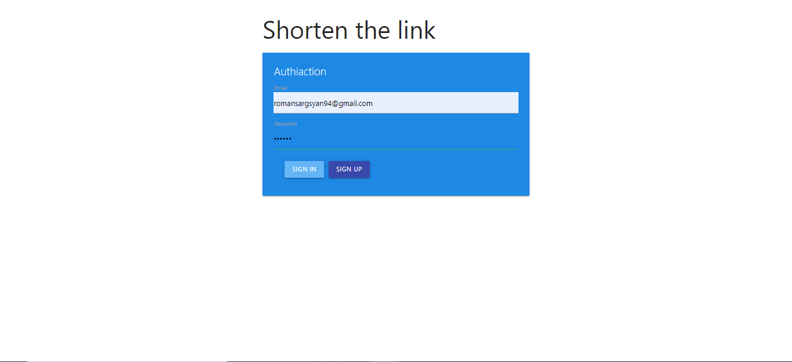
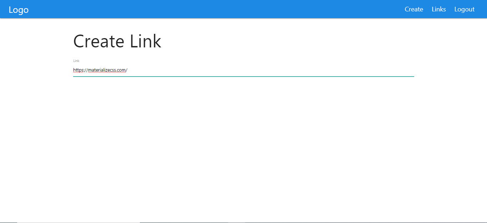
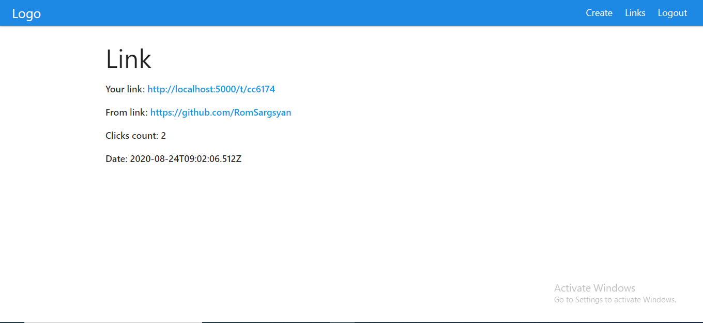
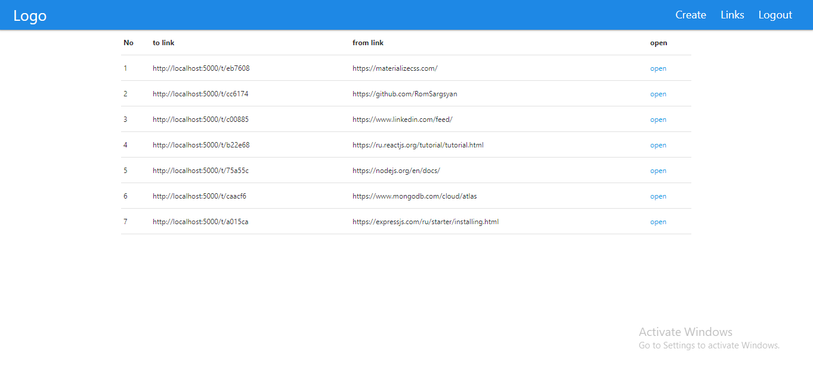

# MERN-app

> MERN - MongoDB, Express, React, Node

## Build Setup

``` bash
# install dependencies
$ yarn install
$ cd ./client
$ yarn install

# serve with hot reload at localhost:3000
$ yarn dev

# server serve with hot reload at localhost:5000
$ yarn start
```

# Screenshots
  Check out some themed installs in these screenshots below:

   
   